# Fract2 CMS File Structure

## Table of Contents
1. [Overview](#overview)
2. [Development Structure](#development-structure)
3. [Distribution Structure](#distribution-structure)
4. [Setup Structure](#setup-structure)
5. [Important Files](#important-files)
6. [Structure Visualization](#structure-visualization)

## Overview

The file structure of Fract2 CMS is divided into three main areas: development, distribution, and setup. This structure allows for efficient development, easy distribution, and straightforward installation of the CMS.

## Development Structure

```
fract2-development/
├── config/
│   ├── config.yaml
│   └── database.yaml
├── docs/
│   ├── architecture_overview.md
│   ├── database_design.md
│   ├── fract2-file-structure.mermaid
│   ├── fract2_file_structure.md
│   ├── installation_process.md
│   ├── package_structure.md
│   └── security_considerations.md
├── packages/
│   ├── f2.atom.tar/
│   ├── f2.content.tar/
│   ├── f2.users.tar/
│   └── f2.webcomponents/
│       ├── src/
│       │   ├── Components/
│       │   │   ├── Fract2BaseComponent.js
│       │   │   └── Fract2InfoCard.js
│       │   └── Services/
│       │       └── WebComponentLoader.php
│       ├── assets/
│       │   └── css/
│       │       └── fract2-info-card.css
│       ├── templates/
│       │   └── webcomponents.twig
│       └── package.yaml
├── system/
│   ├── bootstrap/
│   │   └── tarStreamWrapper.php
│   └── core.tar/
│       └── database/
│           ├── mariadb/
│           │   ├── MariaDBConnection.php
│           │   └── MariaDBQuery.php
│           └── postgres/
│               ├── PostgresConnection.php
│               └── PostgresQuery.php
├── templates/
│   └── index.twig
├── LICENSE.md
├── README.md
├── fract2-dist-packager.sh
└── index.php
```

## Distribution Structure

During the distribution process, a temporary structure is created next to `fract2-setup.sh`:

```
fract2-development/distribution/
├── config/
├── packages/
├── system/
│   └── bootstrap/
├── templates/
├── distribution.tar
└── fract2-setup.sh
```

After the process is complete, all temporary contents are removed. The distribution directory then only contains:

```
fract2-development/distribution/
└── fract2-setup.sh
```

## Setup Structure

The final setup package is created in a separate directory:

```
fract2-setup/
├── distribution.tar
└── fract2-setup.sh
```

## Installed Structure

After running `fract2-setup.sh`, the following structure is created:

```
fract2/
├── config/
│   ├── config.yaml
│   └── database.yaml
├── docs/
│   ├── architecture_overview.md
│   ├── database_design.md
│   ├── fract2-file-structure.mermaid
│   ├── fract2_file_structure.md
│   ├── installation_process.md
│   ├── package_structure.md
│   └── security_considerations.md
├── packages/
│   ├── f2.atom.tar
│   ├── f2.content.tar
│   ├── f2.users.tar
│   └── f2.webcomponents/
│       ├── src/
│       │   ├── Components/
│       │   │   ├── Fract2BaseComponent.js
│       │   │   └── Fract2InfoCard.js
│       │   └── Services/
│       │       └── WebComponentLoader.php
│       ├── assets/
│       │   └── css/
│       │       └── fract2-info-card.css
│       ├── templates/
│       │   └── webcomponents.twig
│       └── package.yaml
├── system/
│   ├── bootstrap/
│   │   └── tarStreamWrapper.php
│   └── core.tar
├── templates/
│   └── index.twig
├── vendor/  # If Composer was used
├── .git/    # If Git initialization was chosen
├── LICENSE.md
├── README.md
└── index.php
```

## Important Files

- `LICENSE.md`: BSD 3-Clause License of the project
- `README.md`: Project overview and documentation
- `fract2-dist-packager.sh`: Script for creating the distribution package
- `index.php`: Main entry point of the application
- `distribution.tar`: Compressed package of all distribution files
- `fract2-setup.sh`: Installation script for the CMS

## Structure Visualization

```mermaid
graph TD
    A[fract2-development 755]:::directory --> B(LICENSE.md 644):::finished
    A --> C(README.md 644):::finished
    A --> D[config 755]:::directory
    A --> E[distribution 755]:::directory
    A --> F[docs 755]:::directory
    A --> G(fract2-dist-packager.sh 755):::script
    A --> H(index.php 644)
    A --> I[packages 755]:::directory
    A --> J[system 755]:::directory
    A --> K[templates 755]:::directory

    D --> D1(config.yaml 644)
    D --> D2(database.yaml 644):::finished

    E --> E1(fract2-setup.sh 755):::script

    F --> F1(architecture_overview.md 644):::finished
    F --> F2(database_design.md 644):::finished
    F --> F3(fract2-file-structure.mermaid 644):::finished
    F --> F4(fract2_file_structure.md 644):::finished
    F --> F5(installation_process.md 644):::finished
    F --> F6(package_structure.md 644):::finished
    F --> F7(security_considerations.md 644):::finished

    I --> I1[f2.atom.tar 755]:::directory
    I --> I2[f2.content.tar 755]:::directory
    I --> I3[f2.users.tar 755]:::directory
    I --> I4[f2.webcomponents 755]:::directory

    I4 --> I4A[src 755]:::directory
    I4 --> I4B[assets 755]:::directory
    I4 --> I4C[templates 755]:::directory
    I4 --> I4D(package.yaml 644):::finished

    I4A --> I4A1[Components 755]:::directory
    I4A --> I4A2[Services 755]:::directory

    I4A1 --> I4A1A(Fract2BaseComponent.js 644):::finished
    I4A1 --> I4A1B(Fract2InfoCard.js 644):::finished

    I4A2 --> I4A2A(WebComponentLoader.php 644):::finished

    I4B --> I4B1[css 755]:::directory
    I4B1 --> I4B1A(fract2-info-card.css 644):::finished

    I4C --> I4C1(webcomponents.twig 644):::finished

    J --> J1[bootstrap 755]:::directory
    J --> J2[core.tar 755]:::directory
    J1 --> J1A(tarStreamWrapper.php 644):::finished

    J2 --> J2A[database 755]:::directory
    J2A --> J2A1[mariadb 755]:::directory
    J2A --> J2A2[postgres 755]:::directory
    J2A1 --> J2A1A(MariaDBConnection.php 644):::finished
    J2A1 --> J2A1B(MariaDBQuery.php 644):::finished
    J2A2 --> J2A2A(PostgresConnection.php 644):::finished
    J2A2 --> J2A2B(PostgresQuery.php 644):::finished

    K --> K1(index.twig 644)

    L[fract2-setup 755]:::directory --> L1(distribution.tar 644):::archive
    L --> L2(fract2-setup.sh 755):::script

    classDef directory stroke:#FFFF00,stroke-width:4px;
    classDef finished stroke:#90EE90,stroke-width:4px;
    classDef script fill:#FFA07A,stroke:#333,stroke-width:2px;
    classDef archive stroke:#FFA500,stroke-width:4px;
```



This structure allows for a clear separation between development, distribution, and installation of the Fract2 CMS.