# Fract2 CMS Dateistruktur

## Inhaltsverzeichnis
1. [Überblick](#überblick)
2. [Hauptverzeichnisstruktur](#hauptverzeichnisstruktur)
3. [Detaillierte Strukturbeschreibung](#detaillierte-strukturbeschreibung)
4. [Entwicklungsumgebung (dev)](#entwicklungsumgebung-dev)
5. [Distributionspaket (dist)](#distributionspaket-dist)
6. [Installierte Struktur](#installierte-struktur)
7. [Wichtige Dateien](#wichtige-dateien)
8. [Visualisierung der Struktur](#visualisierung-der-struktur)

## Überblick

Die Dateistruktur von Fract2 CMS ist so konzipiert, dass sie eine klare Trennung zwischen Entwicklung, Distribution und Installation ermöglicht. Dies fördert eine effiziente Entwicklung und erleichtert den Deployment-Prozess.

## Hauptverzeichnisstruktur

```
fract2-installer/
├── dev/
├── dist/
├── workbench/
├── fract2-install.sh
└── fract2-dist-packager.sh
```

## Detaillierte Strukturbeschreibung

### Entwicklungsumgebung (dev)

Die `dev`-Umgebung enthält alle Quelldateien und ist für die aktive Entwicklung vorgesehen.

```
dev/
├── system/
│   ├── core/
│   │   └── database/
│   │       ├── postgres/
│   │       └── mariadb/
│   └── bootstrap/
├── packages/
│   ├── f2.atom/
│   ├── f2.users/
│   └── f2.content/
├── templates/
│   ├── pages/
│   ├── entities/
│   └── fractals/
├── config/
├── docs/
├── index.php
└── README.md
```

### Distributionspaket (dist)

Das `dist`-Verzeichnis enthält die für die Distribution vorbereiteten Dateien, einschließlich komprimierter Archive.

```
dist/
├── system/
│   ├── bootstrap/
│   └── core.tar
├── packages/
│   ├── f2.atom.tar
│   ├── f2.users.tar
│   └── f2.content.tar
├── templates/
├── config/
├── docs/
├── index.php
└── README.md
```

### Installierte Struktur

Nach der Installation sieht die Struktur wie folgt aus:

```
fract2/
├── system/
│   ├── core/
│   │   └── database/
│   │       ├── postgres/
│   │       └── mariadb/
│   └── bootstrap/
├── packages/
│   ├── f2.atom/
│   ├── f2.users/
│   └── f2.content/
├── templates/
│   ├── pages/
│   ├── entities/
│   └── fractals/
├── config/
├── docs/
├── index.php
└── README.md
```

## Wichtige Dateien

- `fract2-install.sh`: Skript zur Installation des CMS
- `fract2-dist-packager.sh`: Skript zur Erstellung des Distributionspakets
- `index.php`: Haupteinstiegspunkt der Anwendung
- `config/config.yaml`: Hauptkonfigurationsdatei
- `config/database.yaml`: Datenbankkonfigurationsdatei

## Visualisierung der Struktur

Hier ist eine visuelle Darstellung der Fract2 CMS-Struktur:

```mermaid
graph TD
	subgraph Entwicklung [fract2-installer/dev 755]
		A[dev 755]:::directory --> A1[system 755]:::directory
		A --> A2[packages 755]:::directory
		A --> A3[templates 755]:::directory
		A --> A4[config 750]:::directory
		A --> A5(index.php 644):::finished
		A --> A6(README.md 644):::finished
		A --> A7[docs 755]:::directory

		A1 --> A1A[core 755]:::directory
		A1A --> A1A1[database 755]:::directory
		A1A1 --> A1A1A[postgres 755]:::directory
		A1A1 --> A1A1B[mariadb 755]:::directory
		A1A1A --> A1A1A1(PostgresConnection.php 644):::finished
		A1A1A --> A1A1A2(PostgresQuery.php 644):::finished
		A1A1B --> A1A1B1(MariaDBConnection.php 644):::finished
		A1A1B --> A1A1B2(MariaDBQuery.php 644):::finished

		A1 --> A1B[bootstrap 755]:::directory
		A1B --> A1B1(TarStreamWrapper.php 644):::finished
		A1B --> A1B2(Cache.php 644):::finished
		A1B --> A1B3(Logger.php 644):::finished

		A7 --> A7A(architecture_overview.md 644):::finished
		A7 --> A7B(database_design.md 644):::finished
		A7 --> A7C(installation_process.md 644):::finished
		A7 --> A7D(package_structure.md 644):::finished
		A7 --> A7E(security_considerations.md 644):::finished
		A7 --> A7F(fract2_file_structure.md 644):::finished
	end

	subgraph Distribution [fract2-installer/dist 755]
		B[dist 755]:::directory --> B1[system 755]:::directory
		B --> B2[packages 755]:::directory
		B --> B3[templates 755]:::directory
		B --> B4[config 750]:::directory
		B --> B5(index.php 644):::finished
		B --> B6(README.md 644):::finished
		B --> B7[docs 755]:::directory

		B1 --> B1A(core.tar 644):::archive
		B1 --> B1B[bootstrap 755]:::directory
		B1B --> B1B1(TarStreamWrapper.php 644):::finished
		B1B --> B1B2(Cache.php 644):::finished
		B1B --> B1B3(Logger.php 644):::finished

		B7 --> B7A(architecture_overview.md 644):::finished
		B7 --> B7B(database_design.md 644):::finished
		B7 --> B7C(installation_process.md 644):::finished
		B7 --> B7D(package_structure.md 644):::finished
		B7 --> B7E(security_considerations.md 644):::finished
		B7 --> B7F(fract2_file_structure.md 644):::finished
	end

	subgraph Installation [fract2 755]
		C[fract2 755]:::directory --> C1[system 755]:::directory
		C --> C2[packages 755]:::directory
		C --> C3[templates 755]:::directory
		C --> C4[config 750]:::directory
		C --> C5(index.php 644):::finished
		C --> C6(README.md 644):::finished
		C --> C7[docs 755]:::directory

		C1 --> C1A[core 755]:::directory
		C1A --> C1A1[database 755]:::directory
		C1A1 --> C1A1A[postgres 755]:::directory
		C1A1 --> C1A1B[mariadb 755]:::directory
		C1A1A --> C1A1A1(PostgresConnection.php 644):::finished
		C1A1A --> C1A1A2(PostgresQuery.php 644):::finished
		C1A1B --> C1A1B1(MariaDBConnection.php 644):::finished
		C1A1B --> C1A1B2(MariaDBQuery.php 644):::finished

		C7 --> C7A(architecture_overview.md 644):::finished
		C7 --> C7B(database_design.md 644):::finished
		C7 --> C7C(installation_process.md 644):::finished
		C7 --> C7D(package_structure.md 644):::finished
		C7 --> C7E(security_considerations.md 644):::finished
		C7 --> C7F(fract2_file_structure.md 644):::finished
	end

	classDef finished stroke:#90EE90,stroke-width:4px;
	classDef directory stroke:#FFFF00,stroke-width:4px;
	classDef archive stroke:#FFA500,stroke-width:4px;
```



Diese Struktur ermöglicht eine klare Trennung zwischen Entwicklungs-, Distributions- und Installationsphasen, was die Wartung und Weiterentwicklung des Fract2 CMS erleichtert.