# Структура файлов CMS Fract2

## Содержание
1. [Обзор](#обзор)
2. [Структура разработки](#структура-разработки)
3. [Структура дистрибутива](#структура-дистрибутива)
4. [Установленная структура](#установленная-структура)
5. [Ключевые файлы](#ключевые-файлы)
6. [Визуализация структуры](#визуализация-структуры)

## Обзор

Структура файлов CMS Fract2 разработана для обеспечения четкого разделения между разработкой, дистрибуцией и установкой. Эта структура способствует эффективной разработке и упрощает процесс развертывания, одновременно поддерживая многоязычную документацию.

## Структура разработки

```
fract2-development/
├── config/
│   ├── config.yaml
│   └── database.yaml
├── docs/
│   ├── de/
│   │   ├── architecture_overview_de.md
│   │   ├── database_design_de.md
│   │   ├── fract2_file_structure_de.md
│   │   ├── installation_process_de.md
│   │   ├── package_structure_de.md
│   │   └── security_considerations_de.md
│   ├── en/
│   │   ├── architecture_overview_en.md
│   │   ├── database_design_en.md
│   │   ├── fract2_file_structure_en.md
│   │   ├── installation_process_en.md
│   │   ├── package_structure_en.md
│   │   └── security_considerations_en.md
│   ├── es/
│   │   ├── architecture_overview_es.md
│   │   ├── database_design_es.md
│   │   ├── fract2_file_structure_es.md
│   │   ├── installation_process_es.md
│   │   ├── package_structure_es.md
│   │   └── security_considerations_es.md
│   ├── fr/
│   │   ├── architecture_overview_fr.md
│   │   ├── database_design_fr.md
│   │   ├── fract2_file_structure_fr.md
│   │   ├── installation_process_fr.md
│   │   ├── package_structure_fr.md
│   │   └── security_considerations_fr.md
│   ├── ru/
│   │   ├── architecture_overview_ru.md
│   │   ├── database_design_ru.md
│   │   ├── fract2_file_structure_ru.md
│   │   ├── installation_process_ru.md
│   │   ├── package_structure_ru.md
│   │   └── security_considerations_ru.md
│   └── fract2-file-structure.mermaid
├── packages/
│   ├── f2.atom.tar/
│   ├── f2.content.tar/
│   └── f2.users.tar/
├── system/
│   ├── bootstrap/
│   │   └── tarStreamWrapper.php
│   └── core.tar/
│       └── database/
│           ├── mariadb/
│           │   ├── MariaDBConnection.php
│           │   └── MariaDBQuery.php
│           └── postgres/
│               ├── PostgresConnection.php
│               └── PostgresQuery.php
├── templates/
│   └── index.twig
├── LICENSE.md
├── README.md
├── fract2-dist-packager.sh
└── index.php
```

## Структура дистрибутива

Во время процесса дистрибуции создается временная структура:

```
fract2-development/distribution/
├── config/
├── packages/
├── system/
│   └── bootstrap/
├── templates/
├── distribution.tar
└── fract2-setup.sh
```

После завершения процесса директория дистрибуции содержит только:

```
fract2-development/distribution/
└── fract2-setup.sh
```

## Установленная структура

После выполнения `fract2-setup.sh` создается следующая структура:

```
fract2/
├── config/
│   ├── config.yaml
│   └── database.yaml
├── docs/
│   ├── de/
│   ├── en/
│   ├── es/
│   ├── fr/
│   └── ru/
├── packages/
│   ├── f2.atom/
│   ├── f2.content/
│   └── f2.users/
├── system/
│   ├── bootstrap/
│   │   └── tarStreamWrapper.php
│   └── core/
│       └── database/
│           ├── mariadb/
│           └── postgres/
├── templates/
│   └── index.twig
├── vendor/  # Если использовался Composer
├── .git/    # Если была выбрана инициализация Git
├── LICENSE.md
├── README.md
└── index.php
```

## Ключевые файлы

- `LICENSE.md`: BSD 3-Clause лицензия проекта
- `README.md`: Обзор проекта и документация
- `fract2-dist-packager.sh`: Скрипт для создания пакета дистрибутива
- `index.php`: Основная точка входа приложения
- `distribution.tar`: Сжатый пакет всех файлов дистрибутива
- `fract2-setup.sh`: Скрипт установки для CMS

## Визуализация структуры

Для визуального представления структуры файлов, пожалуйста, обратитесь к файлу `fract2-file-structure.mermaid` в директории `docs`.

```mermaid
graph TD
    A[fract2-development 755]:::directory --> B[config 755]:::directory
    A --> C[docs 755]:::directory
    A --> D[packages 755]:::directory
    A --> E[system 755]:::directory
    A --> F[templates 755]:::directory
    A --> G(LICENSE.md 644):::finished
    A --> H(README.md 644):::finished
    A --> I(fract2-dist-packager.sh 755):::script
    A --> J(index.php 644)

    B --> B1(config.yaml 644)
    B --> B2(database.yaml 644):::finished

    C --> C1[de 755]:::directory
    C --> C2[en 755]:::directory
    C --> C3[es 755]:::directory
    C --> C4[fr 755]:::directory
    C --> C5[ru 755]:::directory
    C --> C6(fract2-file-structure.mermaid 644):::finished

    C1 --> C1A(architecture_overview_de.md 644):::finished
    C1 --> C1B(database_design_de.md 644):::finished
    C1 --> C1C(fract2_file_structure_de.md 644):::finished
    C1 --> C1D(installation_process_de.md 644):::finished
    C1 --> C1E(package_structure_de.md 644):::finished
    C1 --> C1F(security_considerations_de.md 644):::finished

    C2 --> C2A(architecture_overview_en.md 644):::finished
    C2 --> C2B(database_design_en.md 644):::finished
    C2 --> C2C(fract2_file_structure_en.md 644):::finished
    C2 --> C2D(installation_process_en.md 644):::finished
    C2 --> C2E(package_structure_en.md 644):::finished
    C2 --> C2F(security_considerations_en.md 644):::finished

    C3 --> C3A(architecture_overview_es.md 644):::finished
    C3 --> C3B(database_design_es.md 644):::finished
    C3 --> C3C(fract2_file_structure_es.md 644):::finished
    C3 --> C3D(installation_process_es.md 644):::finished
    C3 --> C3E(package_structure_es.md 644):::finished
    C3 --> C3F(security_considerations_es.md 644):::finished

    C4 --> C4A(architecture_overview_fr.md 644):::finished
    C4 --> C4B(database_design_fr.md 644):::finished
    C4 --> C4C(fract2_file_structure_fr.md 644):::finished
    C4 --> C4D(installation_process_fr.md 644):::finished
    C4 --> C4E(package_structure_fr.md 644):::finished
    C4 --> C4F(security_considerations_fr.md 644):::finished

    C5 --> C5A(architecture_overview_ru.md 644):::finished
    C5 --> C5B(database_design_ru.md 644):::finished
    C5 --> C5C(fract2_file_structure_ru.md 644):::finished
    C5 --> C5D(installation_process_ru.md 644):::finished
    C5 --> C5E(package_structure_ru.md 644):::finished
    C5 --> C5F(security_considerations_ru.md 644):::finished

    D --> D1[f2.atom.tar 755]:::directory
    D --> D2[f2.content.tar 755]:::directory
    D --> D3[f2.users.tar 755]:::directory

    E --> E1[bootstrap 755]:::directory
    E --> E2[core.tar 755]:::directory
    E1 --> E1A(tarStreamWrapper.php 644):::finished

    E2 --> E2A[database 755]:::directory
    E2A --> E2A1[mariadb 755]:::directory
    E2A --> E2A2[postgres 755]:::directory
    E2A1 --> E2A1A(MariaDBConnection.php 644):::finished
    E2A1 --> E2A1B(MariaDBQuery.php 644):::finished
    E2A2 --> E2A2A(PostgresConnection.php 644):::finished
    E2A2 --> E2A2B(PostgresQuery.php 644):::finished

    F --> F1(index.twig 644)

    classDef directory stroke:#FFFF00,stroke-width:4px;
    classDef finished stroke:#90EE90,stroke-width:4px;
    classDef script fill:#FFA07A,stroke:#333,stroke-width:2px;
```



Эта структура обеспечивает четкое разделение между фазами разработки, дистрибуции и установки CMS Fract2, облегчая поддержку и непрерывное развитие системы.